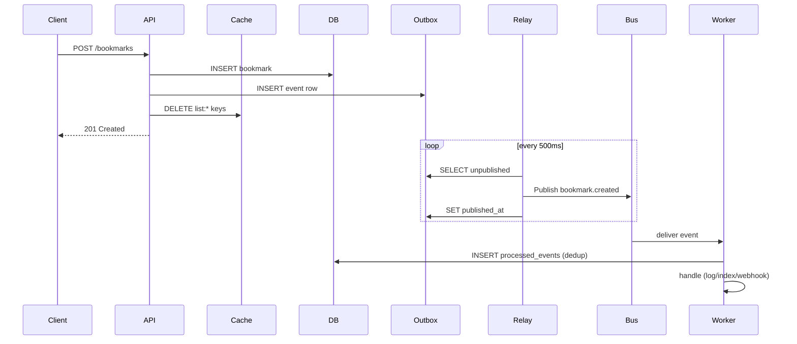
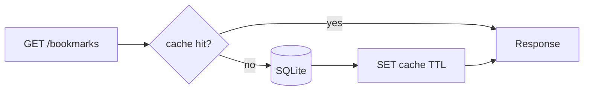

# Async flow — Day 85 capstone

## Create bookmark (happy path)

## Cache read path

## Failure modes

| Scenario | Mitigation |
|----------|------------|
| Publish fails after DB commit | Outbox relay retries |
| Duplicate delivery | `processed_events` dedup key |
| Handler always fails | DLQ after max retries |
| Stale cache | TTL + invalidation on writes |

## Race window

Between DB update and cache invalidation, a reader may see old data for at most `CACHE_TTL_SEC`. Writes always invalidate eagerly.
