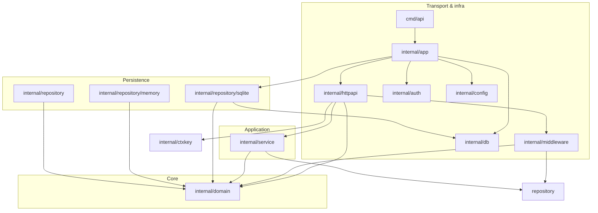

# Package Diagram — Day 59

Sketch import arrows to verify dependency direction. **Update this diagram** if your packages differ.

## Allowed dependencies (inward only)



## Forbidden edges (should NOT exist)

| From | To | Why |
|------|-----|-----|
| `domain` | `httpapi`, `service`, `repository`, `net/http` | Dependency rule |
| `service` | `httpapi`, `net/http` | Services are transport-agnostic |
| `httpapi` | `repository/sqlite` | Handlers talk to services, not DB |
| `repository` | `httpapi`, `service` | Persistence doesn't know use cases |

## How to verify

```powershell
# Quick manual checks
rg "net/http" internal/domain/
rg "database/sql" internal/domain/
rg "repository/sqlite" internal/httpapi/
rg "repository/sqlite" internal/service/

# Automated (after implementing layers_test.go)
go test ./internal/architecture/...
```

## Import cycle detection

```powershell
go list -f '{{.ImportPath}} -> {{join .Imports ", "}}' ./internal/...
```

If Go reports an import cycle during `go build`, draw the packages involved and break the cycle (usually extract shared types to `domain` or `ctxkey`).
